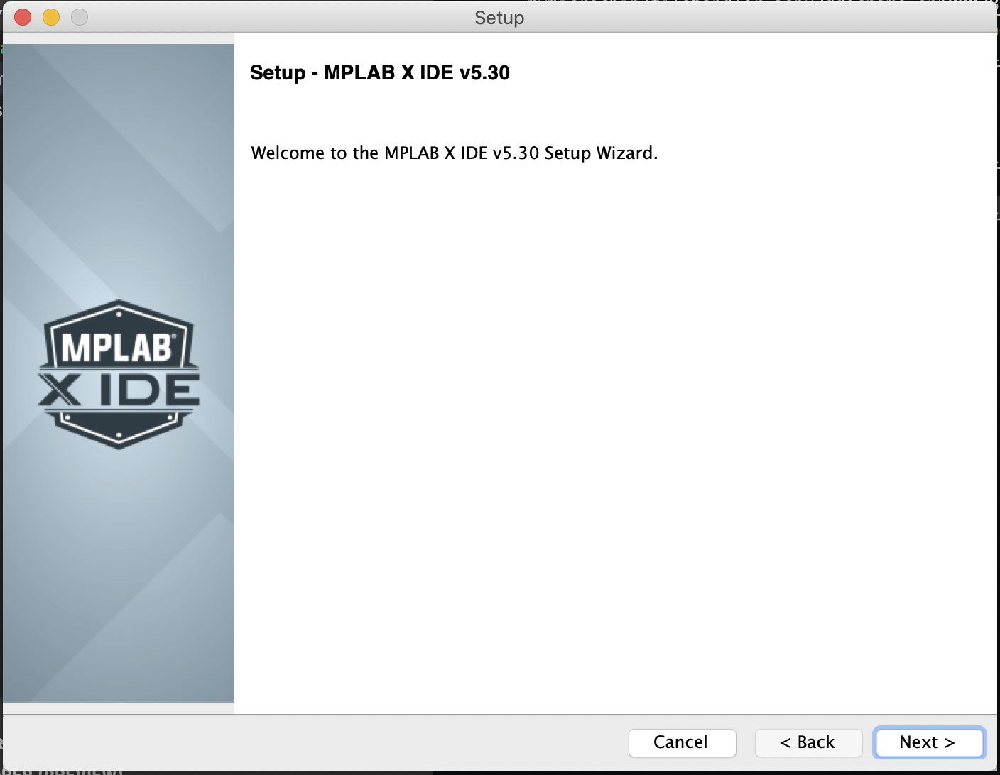
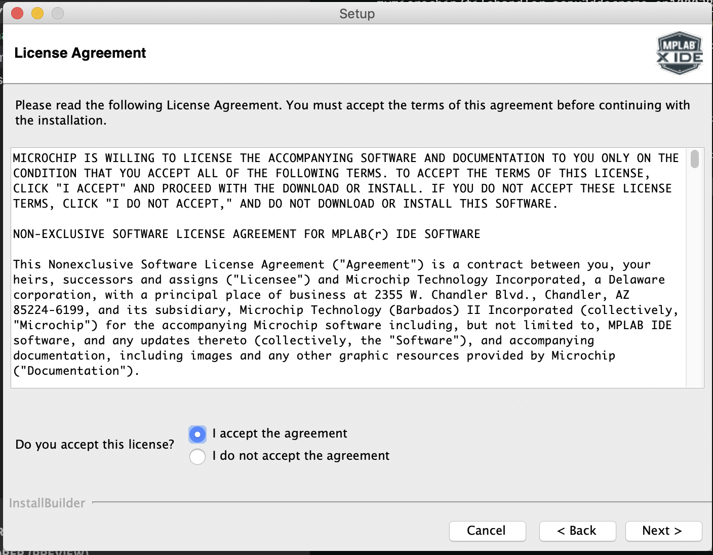
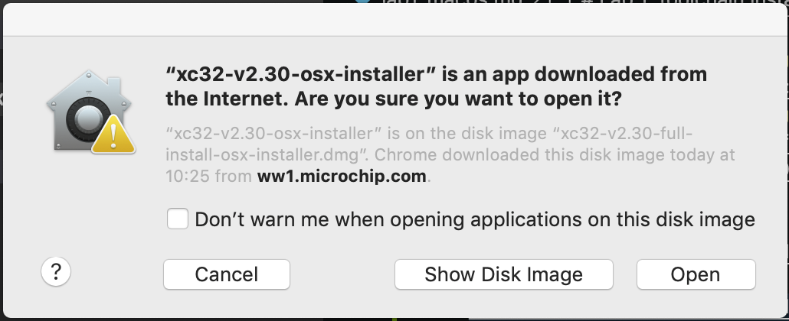
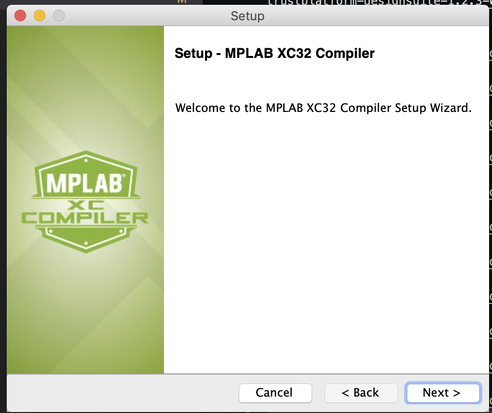
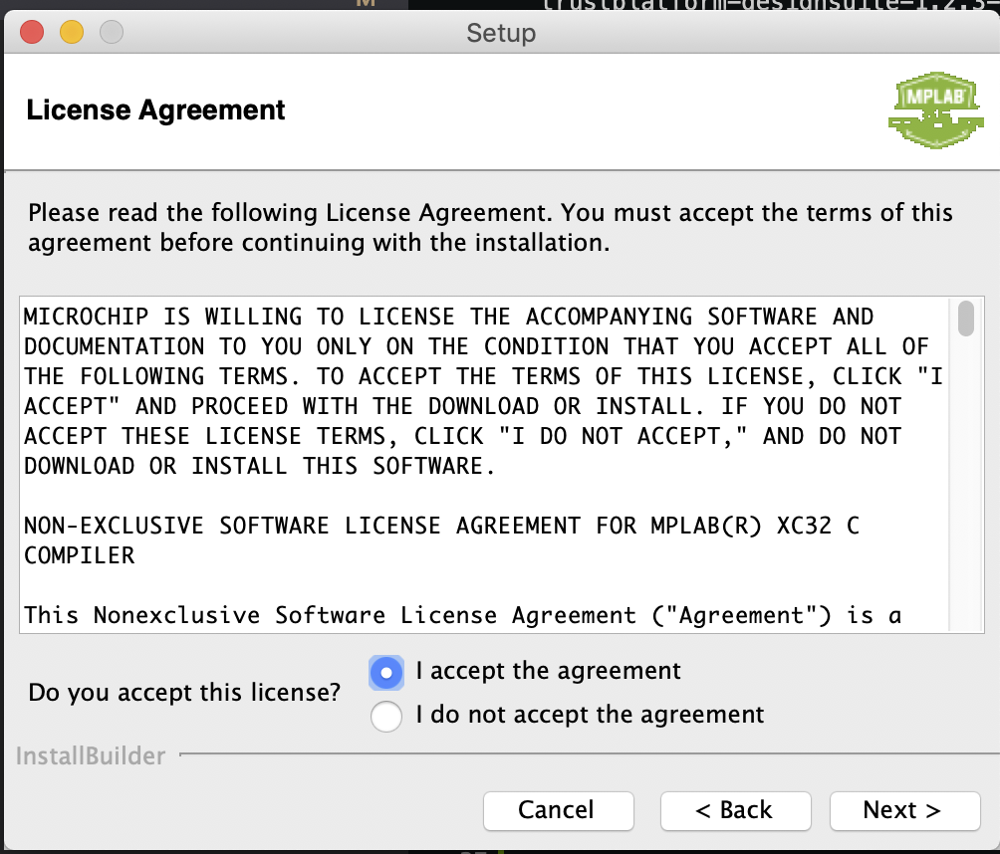
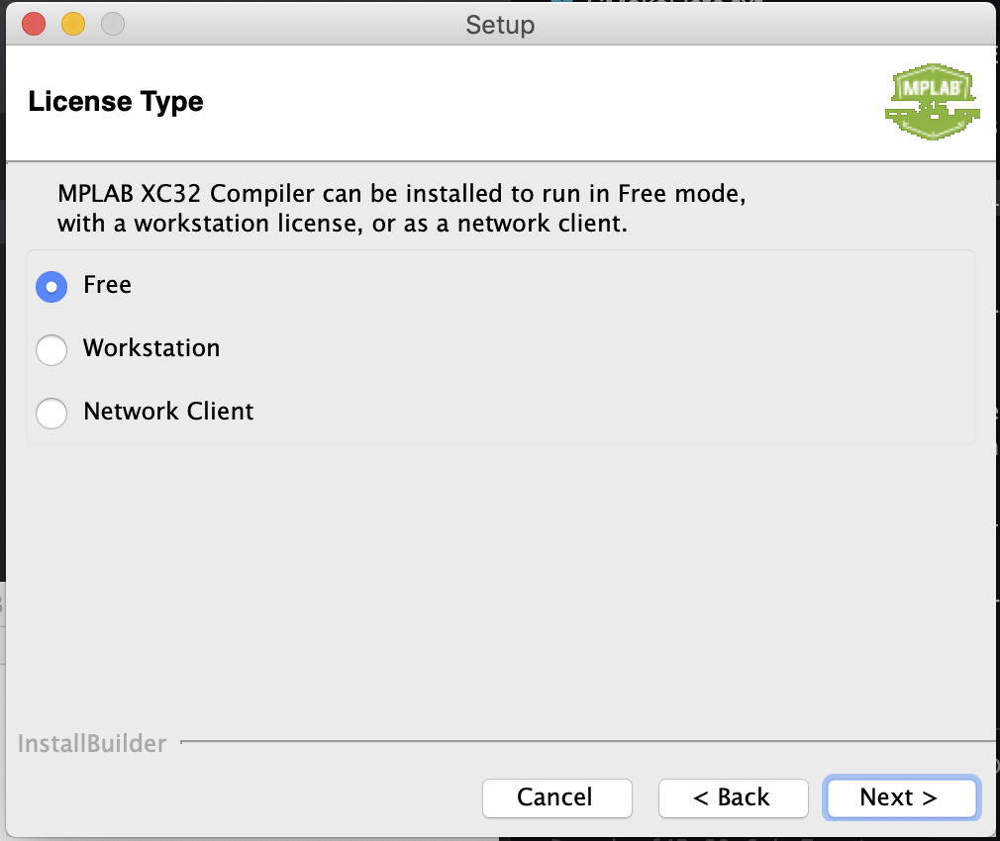
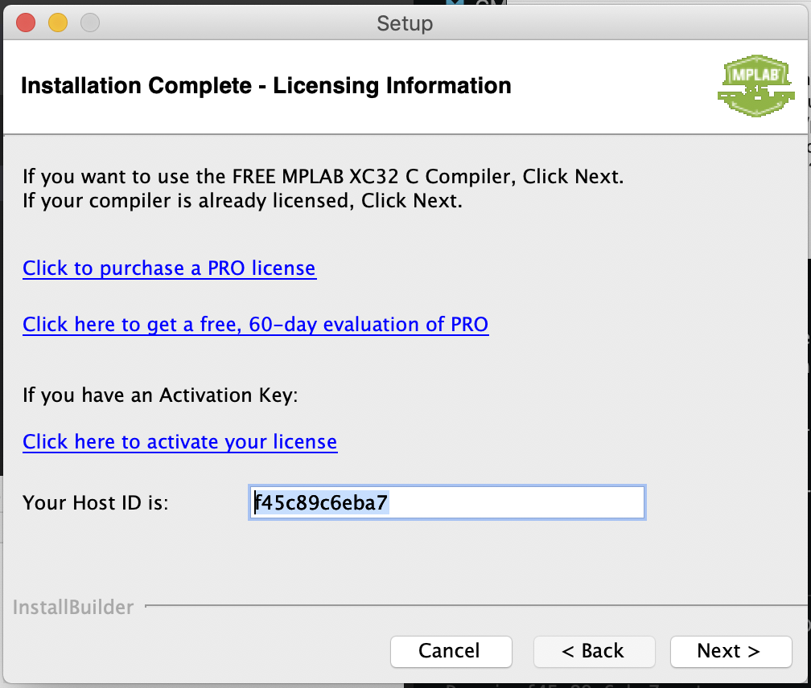
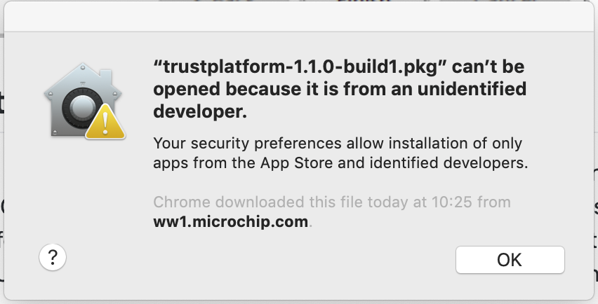
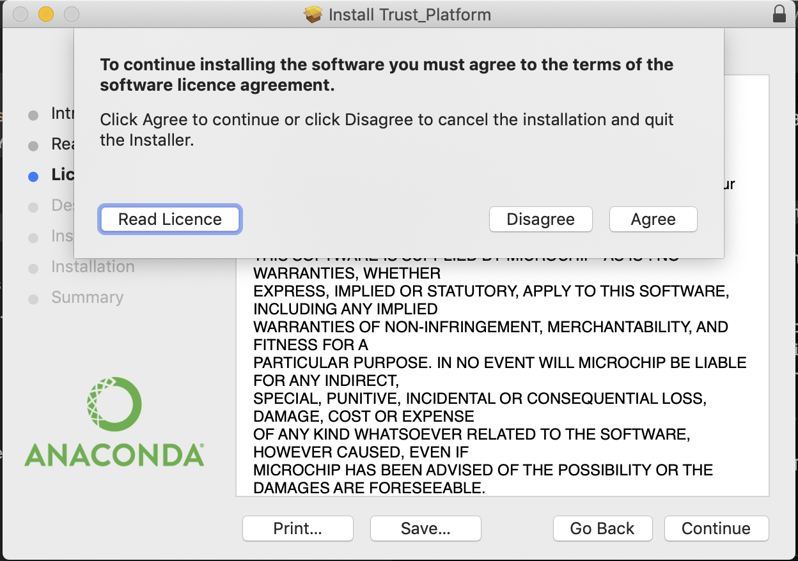
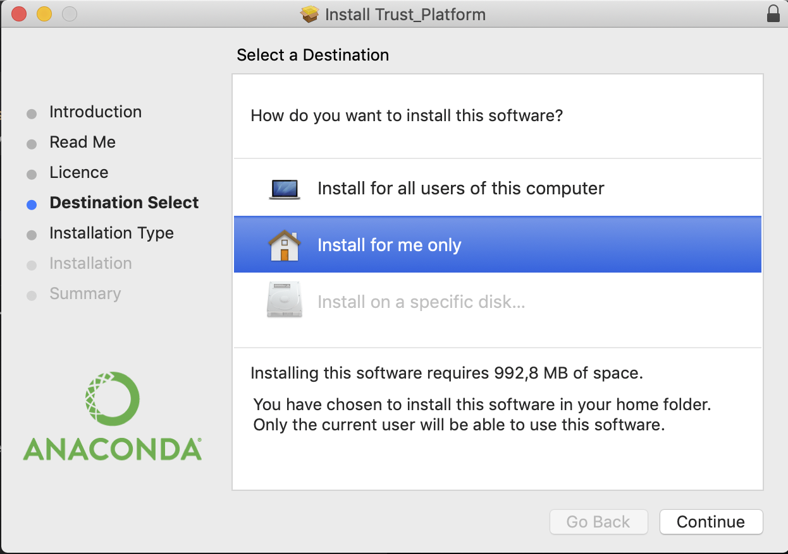

# Lab 1: toolchain installation for Mac OSX

In this document, you will be led through the installation process for the MacOS toolchain.

In a managed workshop, you will be given a USB memory stick which has the installers on it.  **PLEASE USE THE MEMORY STICK** to copy the installers from the macos/ directory on the memory stick to your Downloads directory.

If you are not operating in a managed lab then download the following installers.

* [Microchip MPLAB X 5.30](https://www.microchip.com/mplabx-ide-osx-installer)
* [Microchip XC32 Compiler v2.30](https://www.microchip.com/mplabxc32osx)
* [Microchip Trust Platform Design Suite 1.1.0](https://www.microchip.com/mymicrochip/filehandler.aspx?ddocname=en1000380)
* [Microchip Trust Platform Design Suite Upgrade Package v1.2.3-0](https://anaconda.org/microchip/trustplatform-designsuite/1.2.3/download/noarch/trustplatform-designsuite-1.2.3-0.tar.bz2)

Update packages with `bin/conda update --offline ...`

Run `bin/conda init <shellname>` eg `bin/conda init fish` if you are using fish shell.

NOTE: when done with this Workshop you can undo the modifications to your shell by running `conda init --reverse`

Ensure you are in the right python environment. 

`which pip` should show 

`/Users/angmas/trust_platform/bin/pip`

pip install -r DesignTools/assets/requirements.txt