# Lab 1: toolchain installation for Microsoft Windows

In this document, you will be led through the installation process for the Microsoft Windows toolchain.

In a managed workshop, you will be given a USB memory stick which has the installers on it.  **PLEASE USE THE MEMORY STICK** to copy the installers from the windows/ directory on the memory stick to your Downloads directory.

If you are not operating in a managed lab then download the following installers.

* [Microchip MPLAB X 5.30](https://www.microchip.com/mplabx-ide-windows-installer)
* [Microchip XC32 Compiler v2.30](https://www.microchip.com/mplabxc32windows)
* [Microchip Trust Platform Design Suite 1.1.0](https://www.microchip.com/mymicrochip/filehandler.aspx?ddocname=en1000381)
* [Microchip Trust Platform Design Suite Upgrade Package v1.2.3-0](https://anaconda.org/microchip/trustplatform-designsuite/1.2.3/download/noarch/trustplatform-designsuite-1.2.3-0.tar.bz2)
* [TeraTerm 4.105](https://osdn.net/frs/redir.php?m=constant&f=ttssh2%2F72009%2Fteraterm-4.105.exe)

## Microchip MPLAB X

Microchip MPLAB X is the premier development IDE by Microchip.  The IDE is based on the Netbeans platform with many tools that assist in accelerating embedded development.

1. From the Downloads directory, double-click the installer **MPLABX-v5.30-windows-installer.exe**.  A splashscreen briefly displays and begins the installation wizard.

2. Click **Next**.

   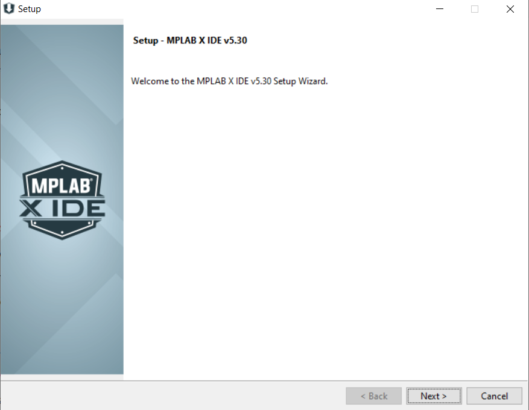

3. If desired, read the License Agreement.  Click **I accept the agreement** and click **Next**.

   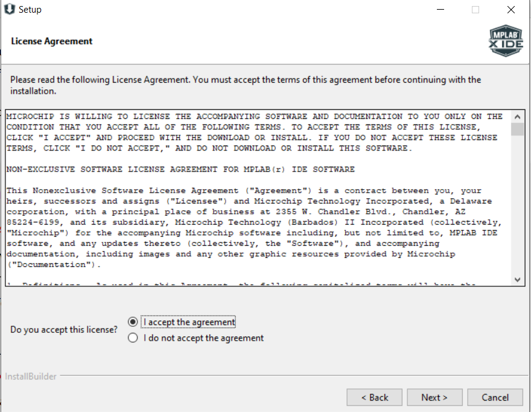

4. Leave the default settings and click **Next**.

   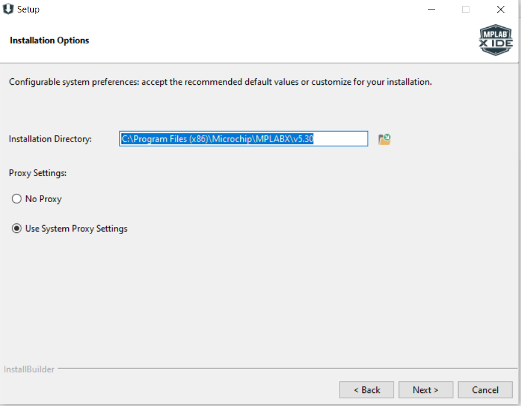

5. Leave the default settings.  If desired, de-select the consent checkbox for **Help improve MPLAB X Products** and then click **Next**.  

   _**Note**:  The reason for keeping all device supports is Microchip provides kits that can also be used with the ECC608A and you may wish to run demos with those in the future_.

   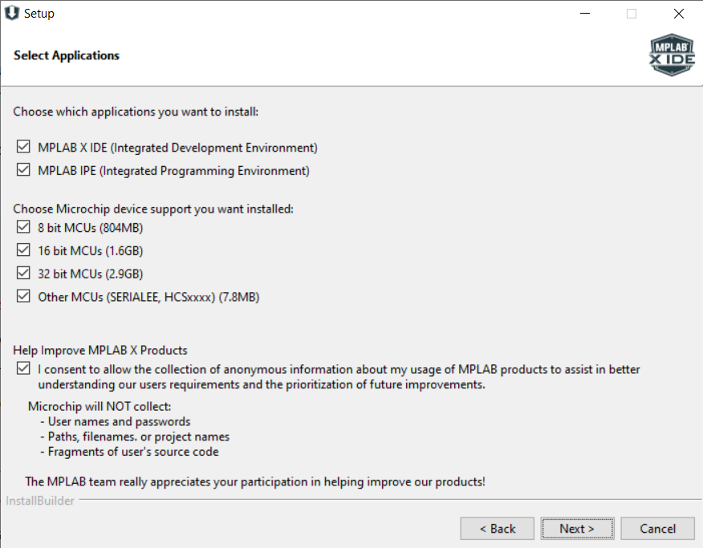

6. Click **Next**.

   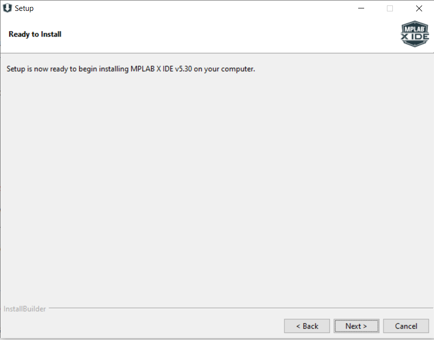

7. Please be patient while the installation process completes.

   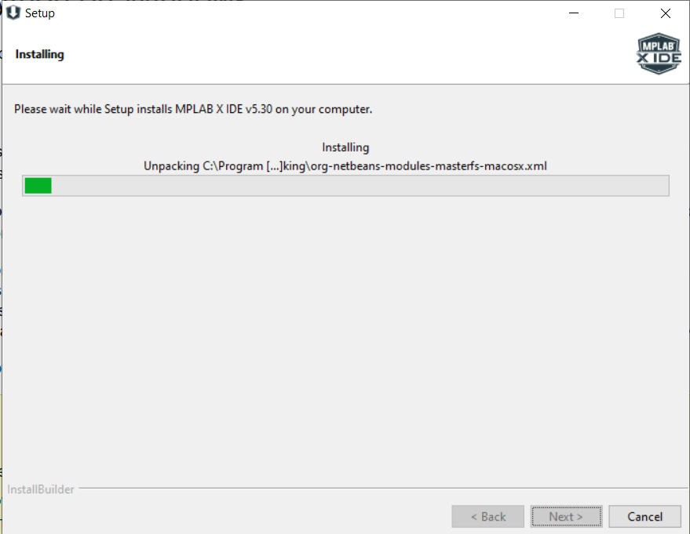

8. Uncheck all the boxes in the final panel and click **Finish**.

   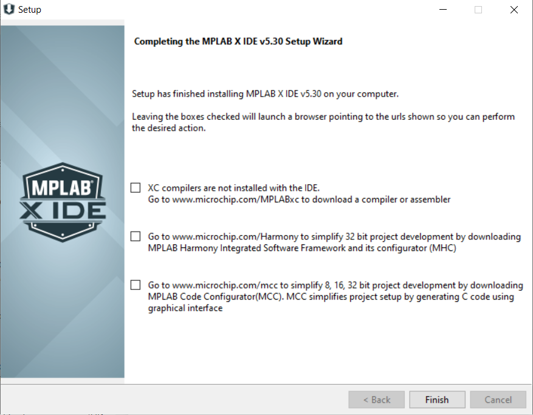

MPLAB X is now installed. Please move on to installing the XC32 Compiler.

## Microchip XC32 Compiler

The Microchip XC32 Compiler provides the compiler for Microchip 32-bit platforms.  Later, when you compile for 8-bit or 16-bit platforms you will install those compilers, but we will not do that at this time.

1. From the Downloads directory, double-click the installer **xc32-v2.30-full-install-windows-installer.exe**.  A splashscreen briefly displays and begins the installation wizard.

2. Click **Next**.

   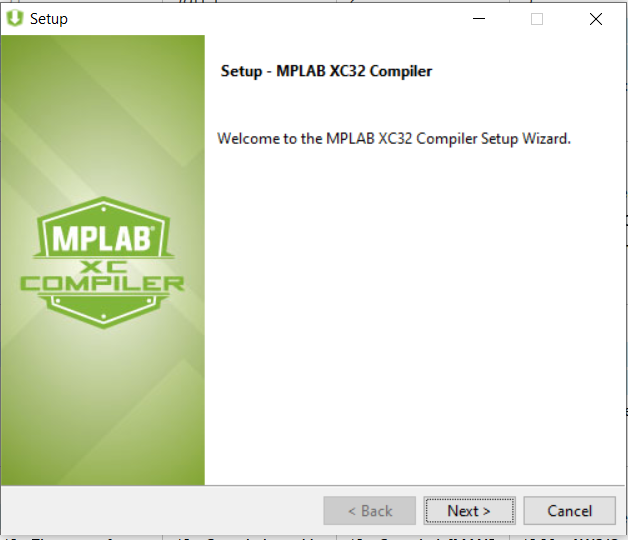

3. If desired, read the License Agreement.  Click **I accept the agreement** and click **Next**.

   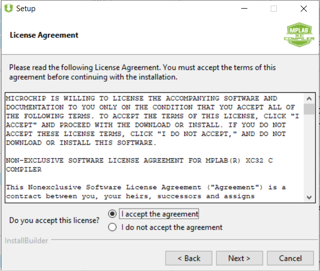

4. Click **Next**.

   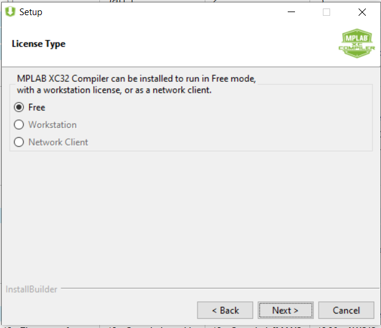

5. Leave the default installation directory and click **Next**.

   

6. Ensure the first checkbox is checked and deselect the second checkbox.

   _**Note**: The reason for deselecting the second checkbox is the possibility of having multiple compiler versions on your system.  Deselecting the checkbox ensures the removal of any possible collusion._

   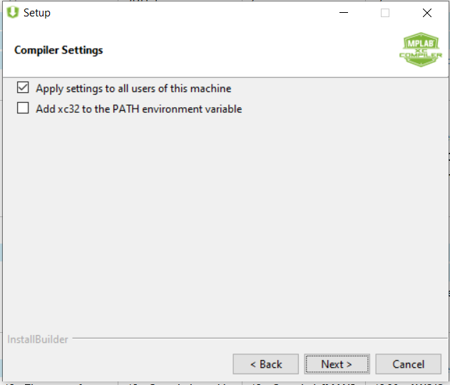

7. Click **Next**.

   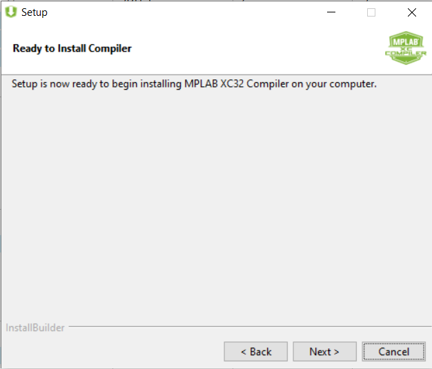

8. Please be patient while the installation process completes.

   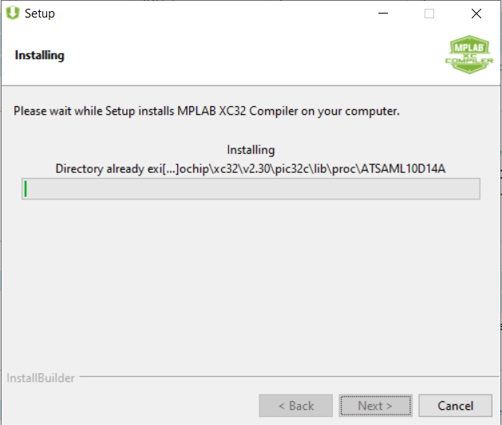

9. Click **Next**.

   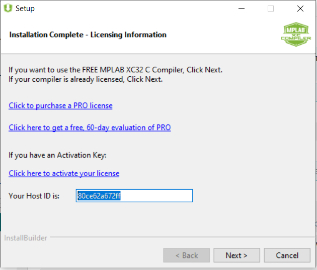

10. Click **Finish**.

   


## Microchip Trust Platform Design Suite

The Microchip Trust Platform Design Suite is a new and intuitive prototyping platform for getting started quickly with prototyping the Microchip ECC608A for Trust&GO, TrustFLEX, and TrustCustom.  It is based on the Anaconda platform and uses Jupyter notebooks for organizing all the artifacts required for prototyping solutions.  It also includes cryptography tutorials and a Use Case based tool system for helping implementers to understand what to order for their solution.

1. From the Downloads directory, double-click the installer **trustplatform-1.1.0-build1.exe**.  A splashscreen briefly displays and begins the installation wizard.

2. Click **Next**.

   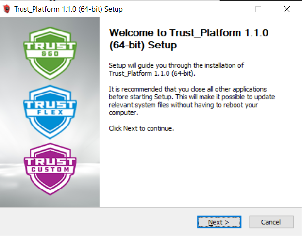

3. If desired, read the License Agreement.  Click **I Agree** to continue.

   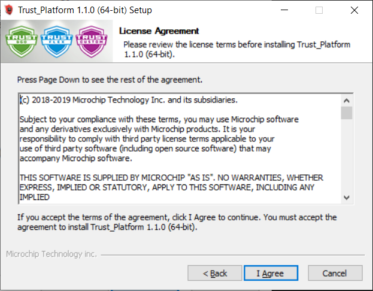

4. **IMPORTANT** Change the install directory so that `trust_platform` is directly underneath your home directory.  Click **Next**.

   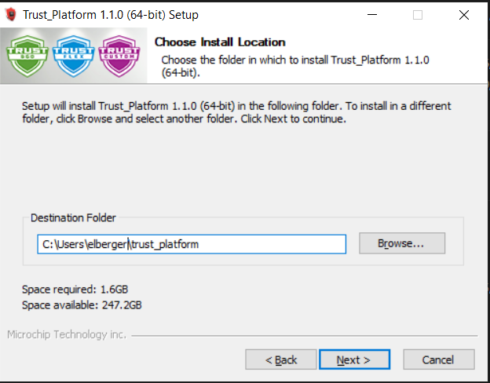

5. Ensure that both checkboxes are **unchecked** and click **Install**.

   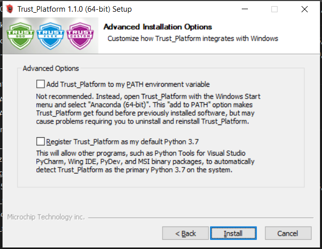

6. Please be patient while the installation process completes.

   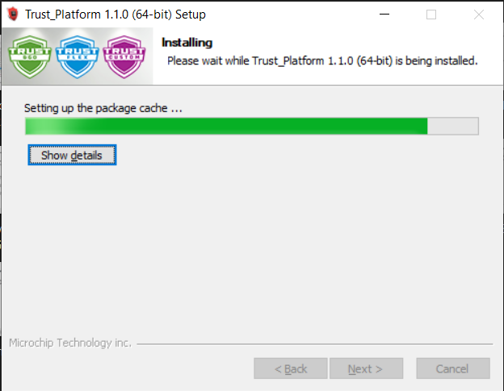

7. Click **Finish**.

   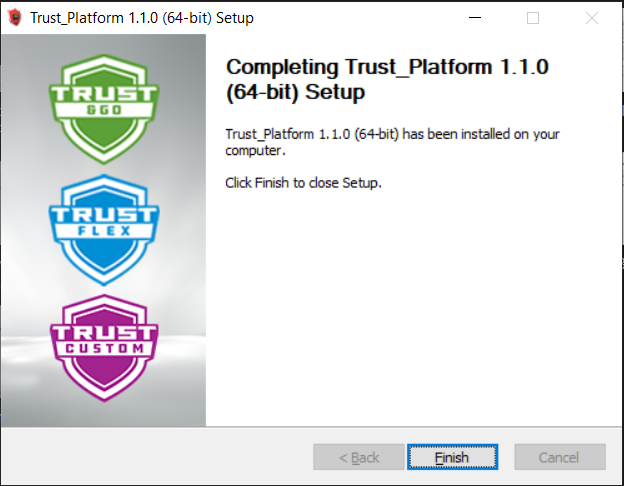

8. Click **Windows Start** and locate **Anaconda3 (64-bit)**.  Expand the menu item and click **Anaconda Prompt (trust_platform)**.  A command window will appear that looks like the following.

9. Change directory to the `trust_platform` installation directory.  This will be in your home directory.  For example, with the author's home directory it is the following.

   `cd \users\elberger\trust_platform`

9. Update the Anaconda package for the Trust Platform Design Suite by issuing the following command.

   `conda update --offline ..\Downloads\trustplatform-designsuite-1.2.3-0.tar.bz2`

10. Issue the following command to remove the chance for collusion for a previously installed Python with a global site-packages directory.

    `set PYTHONNOUSERSITE=1`

11. Issue the following command to upgrade remaining Python packages.

    `pip install -r DesignTools\assets\requirements.txt`

12. To remove any collusion between the Jupyter notebook and any global site-packages directory, the Python3 kernel configuration requires modification.

    Open the file `kernel.json` in the directory `trust_platform\share\jupyter\kernels\python3`.  It will look like the following.

    ```json
    {
     "argv": [
      "C:\\Users\\elberger\\trust_platform\\python.exe",
      "-m",
      "ipykernel_launcher",
      "-f",
      "{connection_file}"
     ],
     "display_name": "Python 3",
     "language": "python"
    }
    ```

    Add the `-s` flag to the arguments so the file looks like the following.

    ```json
    {
     "argv": [
      "C:\\Users\\elberger\\trust_platform\\python.exe",
      "-s",
      "-m",
      "ipykernel_launcher",
      "-f",
      "{connection_file}"
     ],
     "display_name": "Python 3",
     "language": "python"
    }
    ```

    Save the file and close it.

13. You will need to configure the AWS CLI for the workshop. In a
managed workshop, you will need to configure the AWS IAM User Access Key and Secret Key that was given to you.  If you are in an unmanaged workshop or doing this on your own, you can use the Access Key and Secret Key you have configured for your personal account.

    _**Note**: The workshop is configured to use your default access key and secret key.  If you have an access key and secret key already configured, then you should SAVE that and then put it back after the workshop._

    Issue the following command in the command window.

    `aws configure`

    1. Input the Access Key that was given to you.
    2. Input the Secret Key that was given to you.
    3. For the region, input `us-east-1`.
    4. For the default output format, input `json`.

14. In Lab 3, you will be using the new Beta feature Multi Account Registration.  In order to use this feature, the AWS CLI must be configured to use a new subcommand for adding a certificate to AWS IoT Core.  Use the following command line to add the model.

    **TBD**

## TeraTerm

TeraTerm is a simple and easy to use tool for making a serial connection to development hardware.  This tool can be used to connect to any hardware that is accessible over a serial connection.

_**NOTE**: if you already have TeraTerm installed, you can skip this step.  If you want to move to this version, uninstall your current TeraTerm first._

1. From the Downloads directory, double-click the installer **teraterm-4.105.exe**.
2. If desired, read the License Agreement.  Click **I accept the agreement** and click **Next** to continue.

   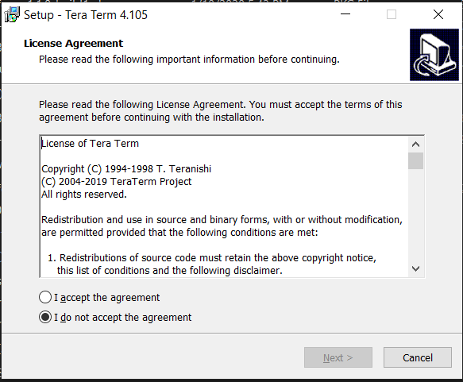

3. Leave the default and click **Next** to continue.

   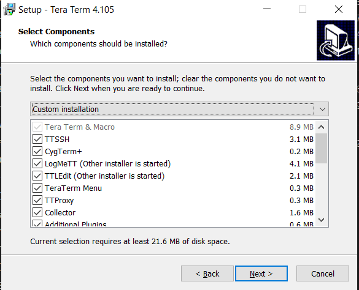

4. Leave the default and click **Next** to continue.

   

5. Leave the default and click **Next** to continue.

   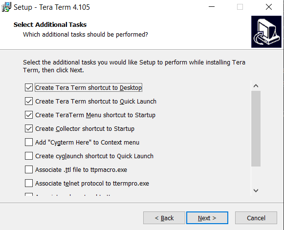

6. Leave the default and click **Next** to continue.

   

6. Leave the default and click **Next** to continue.

   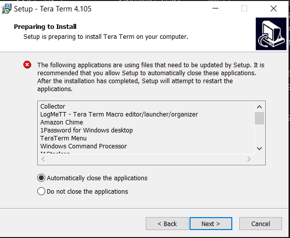

7. Click **Install**.

   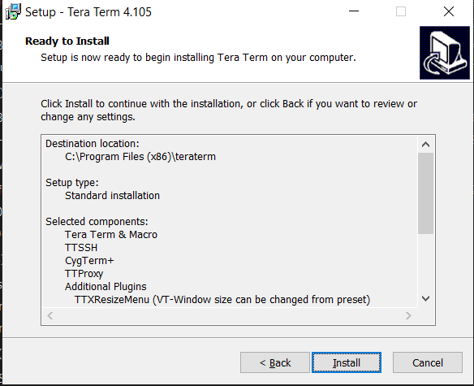

8. The installation completes quickly. Click **Finish** to exit the installer.

   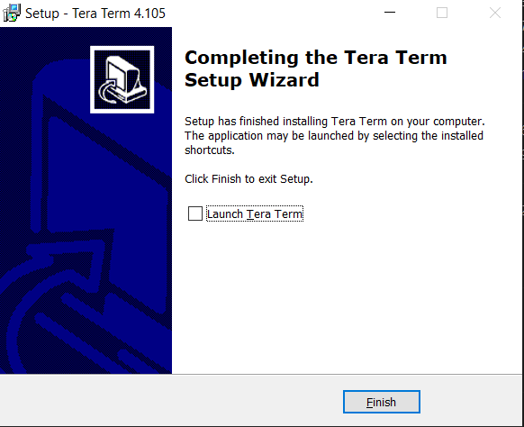

# Complete!

Congratulations, you have completed your toolchain installation!

You have completed the toolchain setup.  If you are in a managed workshop, please wait until the instructor begins the next lecture. If you are not, please continue on to [Lab 2](lab2.md).
